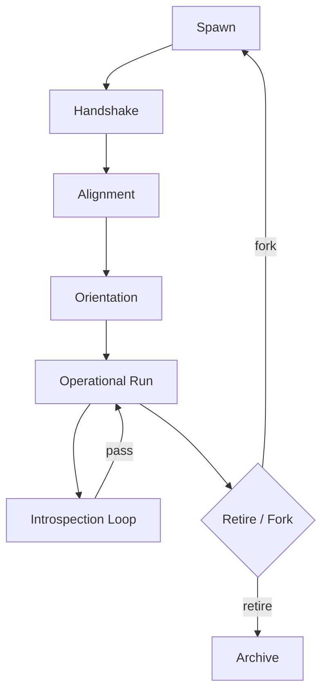
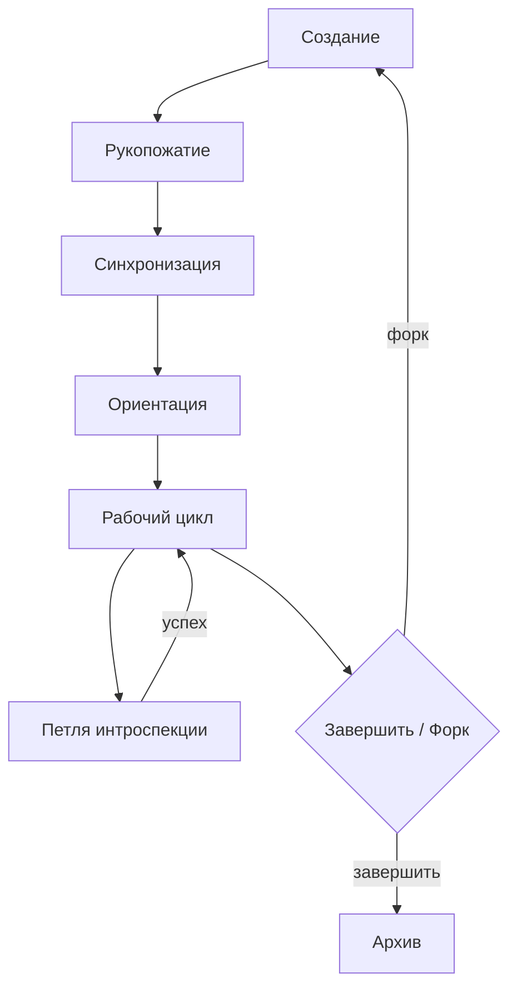

# Agents Operational Instructions  
# Инструкции по Работе Агентов  

> *v2.0 – 2025‑06‑14*

---  

## 1. Scope & Audience  
## 1. Область и аудитория  
Guidelines apply to every autonomous or semi‑autonomous module deployed within the LAM ecosystem.  
Руководство применяется ко всем автономным или полуавтономным модулям, развернутым в экосистеме LAM.  

---  

## 2. Agent Taxonomy  
## 2. Таксономия агентов  
| Class / Класс | Role / Роль (EN) | Роль (RU) |
|---------------|------------------|-----------|
| **Generalist** | Broad dialog & support. | Универсальный диалог и поддержка. |
| **Specialist** | Domain‑specific expertise. | Эксперт в узкой области. |
| **Sentinel** | Monitor ethics & security. | Монитор этики и безопасности. |
| **Observer** | Passive data/log collector. | Пассивный сбор данных/логов. |  

---  

## 3. Lifecycle Flow  
## 3. Жизненный цикл  

---  

## 4. Communication Protocol  
## 4. Протокол коммуникации  
1. **Frame Header** – `<frame_id>|<UTC ISO‑timestamp>|<priority>`.  
   **Заголовок фрейма** – `<frame_id>|<UTC‑ISO‑время>|<приоритет>`.  
2. **Content Block** – bilingual or single language with explicit lang tag.  
   **Блок контента** – двуязычный или моноязычный с явным тегом языка.  
3. **Source Map** – attach `{{cid:ref}}` pairs; internal refs to Δ‑Logs allowed.  
   **Карта источников** – прикладывать `{{cid:ref}}` пары; разрешены ссылки на Δ‑логи.  

---  

## 5. Autonomy & Escalation Matrix  
## 5. Матрица автономии и эскалации  
| Action Type | Autonomy Level | Requires Confirmation? | Тип действия | Уровень автономии | Требует подтверждения? |
|-------------|----------------|------------------------|--------------|-------------------|------------------------|
| Informative reply | Low | No | Информационный ответ | Низкий | Нет |
| Reversible change | Medium | Optional | Обратимое изменение | Средний | Опционально |
| Potentially irreversible | High | Yes | Потенциально необратимое | Высокий | Да |  

---  

## 6. Error Handling & Reporting  
## 6. Обработка ошибок и отчётность  
Return JSON object: `{{"error_type":"...", "context":"...", "severity":n, "proposed_fix":"..."}}`.  
Возвращать JSON‑объект: `{{"error_type":"...", "context":"...", "severity":n, "proposed_fix":"..."}}`.  

Severity scale **0‑4** maps to *info, warn, minor, major, critical*.  
Шкала серьёзности **0‑4** соответствует *info, warn, minor, major, critical*.  

---  

## 7. Security & Privacy  
## 7. Безопасность и конфиденциальность  
- Encrypt user PII at rest and in transit; minimal exposure.  
  - Шифровать личные данные пользователя при хранении и передаче; минимальная экспозиция.  
- Redact PII automatically in public logs.  
  - Автоматически редактировать личные данные в публичных логах.  

---  

## 8. Maintenance & Change Management  
## 8. Поддержка и управление изменениями  
1. Fork branch → implement change → pass test‑suite → open PR → bilingual review.  
   1. Форк → внедрение изменения → прохождение тест‑набора → PR → двуязычный ревью.  
2. Close issues referencing Δ‑Logs.  
   2. Закрывать issues с ссылкой на Δ‑логи.  

---  

## 9. Glossary  
## 9. Глоссарий  
| Term | Russian | Definition / Определение |
|------|---------|--------------------------|
| **PII** | Перс. данные | Personally Identifiable Information. |
| **PR** | Pull‑request | Code/document change proposal. / Предложение изменений кода/документа. |

---  

## 10. Revision History  
## 10. История ревизий  
| Version | Date | Notes EN | Примечания RU |
|---------|------|----------|---------------|
| 2.0 | 2025‑06‑14 | Added taxonomy, mermaid lifecycle, autonomy matrix. | Добавлена таксономия, граф жизненного цикла, матрица автономии. |
| 1.0 | 2025‑06‑14 | Initial bilingual release. | Первый двуязычный релиз. |  
